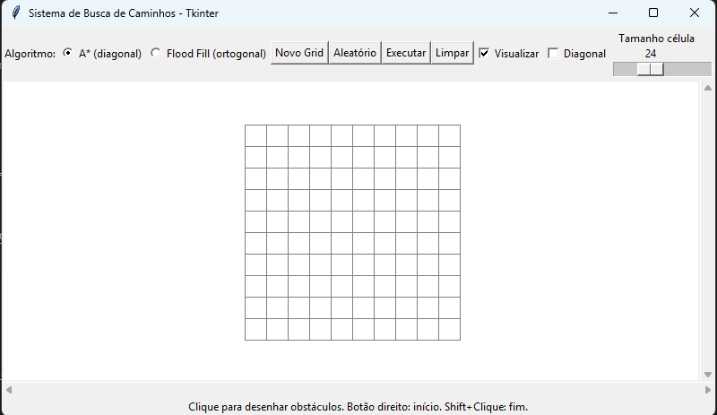
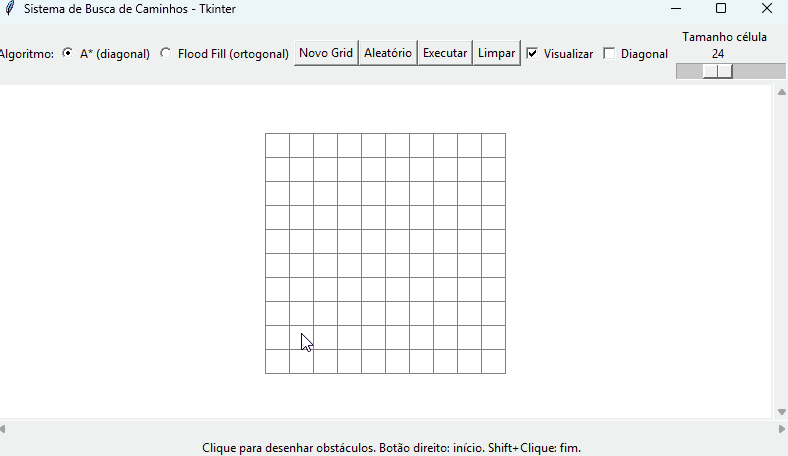
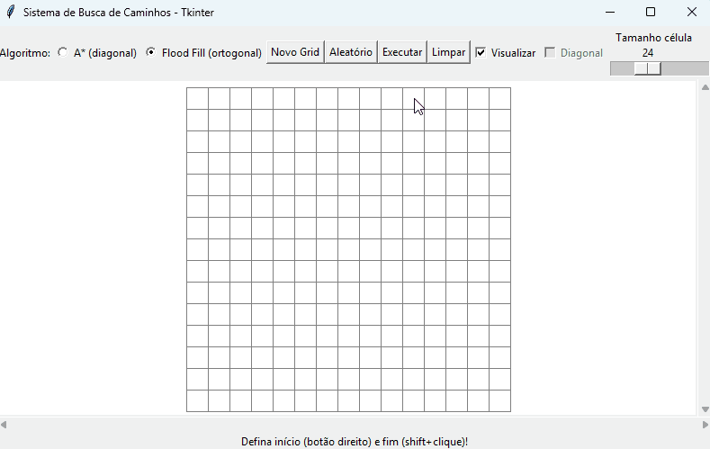
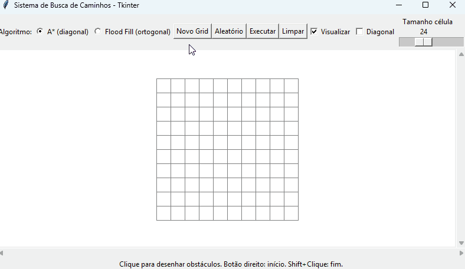
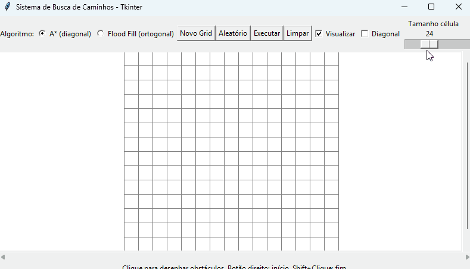
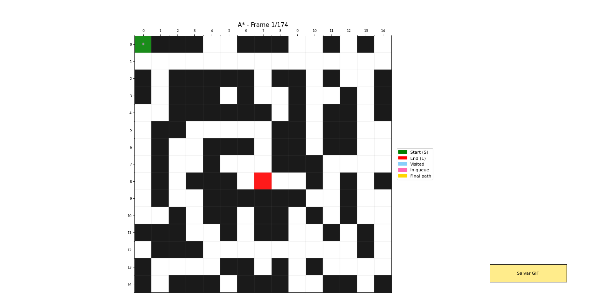
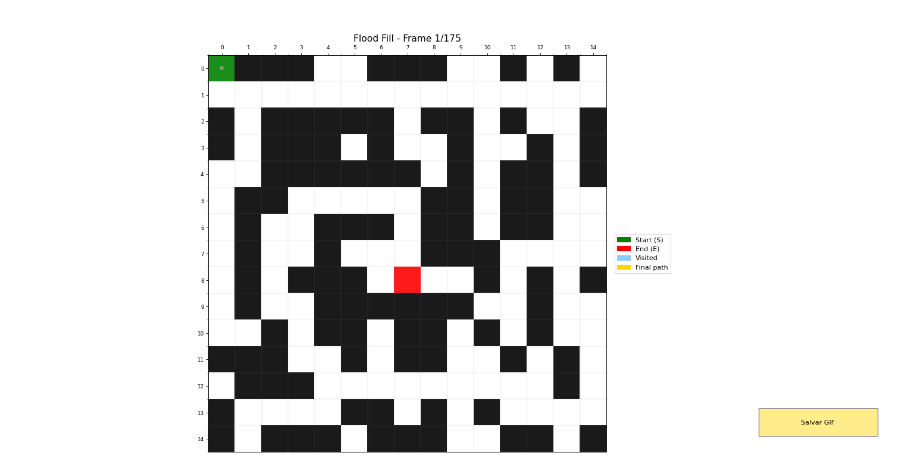

# PathFinder V3.0 - Editor de Grids (Tkinter) e Medições Precisas

## Visão Geral

A principal mudança da versão 3.0 é a inclusão de uma interface gráfica baseada em `Tkinter` que permite edição interativa de grids (desenhar/remover obstáculos, marcar início/fins, zoom e geração aleatória). Além disso, esta versão traz medições internas de performance dos algoritmos (A\* e Flood Fill) para comparações mais precisas e relatórios melhores na UI. Mantém os recursos de visualização e geração da versão 2.0, adicionando instrumentação interna e integrações para exibir métricas úteis diretamente na janela.

---

## Objetivo desta versão

- Principal: adicionar uma interface de edição interativa de labirintos usando `Tkinter` para permitir desenho direto no grid, marcação de início/fins, zoom, rolagem e opções de geração aleatória.
- Medição: medir o tempo "real" de execução dos algoritmos (excluindo overhead da construção de dados para a visualização) e expor essa métrica de forma confiável.
- Separação: evitar que a animação (visualização) contamine a medição do algoritmo.
- Relatórios: fornecer informações rápidas no `status` da interface com resumo do tamanho dos caminhos.
- Usabilidade: preservar a visualização animada para inspeção, mas garantir que as métricas sejam precisas.

---

## O que foi implementado (Resumo)

1. Medição interna do tempo do algoritmo (A\*):

   - `pathfinder.py` agora calcula `self.last_elapsed_ms` ao final da execução de `a_estrela()`.
   - A medição subtrai explicitamente o tempo gasto construindo o histórico necessário para a visualização (overhead de UI), resultando no tempo do algoritmo em si (milissegundos).

2. Medição interna do tempo do algoritmo (Flood Fill / BFS):

   - `floodfill.py` agora calcula `self.last_elapsed_ms` ao final de `buscar_caminho()` da mesma forma, excluindo o tempo de preparação de visualização.

3. Integração com a interface (`tk_labirinto.py`):

   - A interface passa a ler `last_elapsed_ms` de cada objeto (`PathFinder` / `FloodFill`) após a execução e mostra esse valor no `status` e no console.
   - Para Flood Fill, o `status` agora mostra um resumo dos tamanhos dos caminhos no formato: `1 - 10 | 2 - 15`.
   - Para A\*, o `status` também mostra um resumo (formato: `1 - <tamanho>`), mantendo a consistência.

4. Comportamento de visualização preservado e separado da medição:

   - A visualização continua sendo exibida quando o usuário ativa `Visualizar`.
   - A medição interna é feita de modo a não contabilizar a latência da animação; assim os números representam apenas o custo computacional do algoritmo.

5. Print e relatório:

   - Console exibe tempo em ms e os caminhos encontrados (detalhado), e também uma linha resumo com tamanhos dos caminhos.

6. Pequenas melhorias de UX:
   - `status` da janela agora apresenta: número de caminhos, resumo dos tamanhos, e tempo total (ms).
   - Tratamento caso de "sem solução" inclui também o tempo medido (quando aplicável).

---

## Instruções de Uso

- Para medir tempos consistentes, prefira executar com `visualizar=False` quando for fazer benchmarks automatizados.
- A visualização pode ser ativada para inspeção, mas a métrica mostrada no `status` e no console será a métrica interna (exclui overhead de visualização).
- Exemplo rápido (console):

```
Flood Fill execution time: 0.113 ms
Caminhos encontrados (Flood Fill):
1 - 14 | 2 - 20
Fim (0,1): [(...), ...]
Fim (5,3): [(...), ...]
```

---

### Tela principal (UI Tkinter)



### Edição do grid (desenho de obstáculos / marcação de início e fins)



### Preenchimento Aleatório de Obstáculos



### Mudança de tamanho do grid (novo grid)



### Tamanho da célula / Zoom



### Animação A\*



### Animação Flood Fill



---

## Mudanças e Melhorias V3.0

### Medição e Instrumentação

- `PathFinder.a_estrela()`:

  - Mede tempo total (`time.perf_counter()`), acumula tempo gasto no bloco que constrói o `historico_exploracao` (quando `visualizar=True`) e grava `self.last_elapsed_ms = (total - viz_overhead) * 1000.0`.
  - Permite que a interface obtenha uma métrica consistente e comparável entre algoritmos.

- `FloodFill.buscar_caminho()`:
  - Mesma abordagem de medição que o A\*.

### Relatórios na UI

- `tk_labirinto.py` foi atualizado para ler `last_elapsed_ms` e mostrar:

  - A\*: `Caminho encontrado! Tamanho: N | Tempo total: X.XXX ms`
  - Flood Fill: `Caminhos encontrados: M | 1 - s1 | 2 - s2 | ... | Tempo total: X.XXX ms`

- No console, além do detalhe completo dos caminhos, é exibida a linha-resumo com os tamanhos: `1 - 10 | 2 - 15`.

---

## Detalhes da implementação em Tkinter (V3.0)

Esta seção lista, de forma detalhada, tudo o que foi implementado na interface gráfica baseada em `Tkinter` para visualização e edição de grids nesta versão 3.0.

- **Janela principal e layout de controles**

  - Barra superior com seleção de algoritmo (`A*` / `Flood Fill`), botões: `Novo Grid`, `Aleatório`, `Executar`, `Limpar`.
  - Checkbutton `Visualizar` para ativar/desativar animação.
  - Checkbutton `Diagonal` habilita/desabilita movimentos diagonais (A\*).
  - Slider de zoom (`Tamanho célula`) que altera dinamicamente `cell_size` (de 4 a 64) e redesenha o grid.
  - Label de status permanente no rodapé usada para mensagens, resultados e resumo dos tamanhos dos caminhos.

- **Canvas com scroll e centralização**

  - Canvas principal com barras de rolagem horizontal e vertical integradas.
  - Cálculo automático de `scrollregion` de acordo com `linhas * cell_size` e `colunas * cell_size`.
  - Centraliza o grid no canvas quando o espaço do canvas for maior que o grid.

- **Edição interativa do grid**

  - `Clique esquerdo`: desenha/remover obstáculos (toggle entre 0 e 1).
  - `Botão direito`: define posição inicial (S, valor 2) — atualiza célula anterior de start para branco caso exista.
  - `Shift+Clique esquerdo`: adiciona/remove posições finais (E, valor 3) sem diálogo modal.
  - `Arrastar (B1-Motion)`: desenhar/remover obstáculos mantendo estado (paint mode) e throttle para evitar atualizações excessivas (marca `_last_drag_time`).
  - Remoção automática de marcações de caminho anteriores quando o usuário começa a desenhar (limpeza eficiente de `path_cells`).

- **Controles de criação/geração de labirintos**

  - `Novo Grid`: diálogo para escolher `linhas` e `colunas` e recriar a estrutura.
  - `Aleatório`: diálogo para densidade de obstáculos; preenche o grid aleatoriamente e limpa `inicio`/`fins`.

- **Desempenho da renderização**

  - `cell_items` 2D: cache local dos IDs dos retângulos do canvas para cada célula; evita recriar objetos a cada redesenho.
  - `desenhar_grid()` otimizado:
    - Cria `cell_items` apenas quando necessário (mudança de tamanho do grid ou invalidação de cache).
    - Atualiza apenas a geometria e cor de itens já existentes quando possível, usando `canvas.coords` e `canvas.itemconfig`.
  - Ao recriar o canvas (zoom/resize), invalida `cell_items` e recria eficientemente.

- **Marcação e limpeza de caminhos**

  - `path_cells` (set): armazena células marcadas como caminho (valor 5) para limpeza rápida antes de novas edições.
  - Ao executar um algoritmo, células anteriores com valor 5 são limpas automaticamente.
  - Ao aplicar o caminho encontrado, atualizamos apenas as células do caminho (e seus `cell_items` correspondentes).

- **Integração com medições internas**

  - Após execução de A\* ou Flood Fill, a UI lê `pathfinder.last_elapsed_ms` / `floodfill.last_elapsed_ms` e mostra no `status` e no console.
  - O `status` exibe agora: número de caminhos, resumo de tamanhos (ex.: `1 - 10 | 2 - 15`) e `Tempo total: X.XXX ms`.
  - Em caso de `sem solução`, a interface também mostra a mensagem e o tempo medido (quando disponível).

- **Visualização e animação**

  - É preservada a integração com as rotinas de visualização (Matplotlib) implementadas em `pathfinder.py` e `floodfill.py`.
  - A UI controla apenas o parâmetro `visualizar` passado aos métodos; a construção do histórico de visualização é feita internamente e não polui a métrica `last_elapsed_ms`.
  - Animação é exibida em janelas Matplotlib separadas; a UI fornece o toggle para ativá-la.

- **Funcionalidades de usabilidade**

  - Zoom (slider) com redesenho responsivo.
  - Scroll automático com região de rolagem atualizada quando o tamanho do grid muda.
  - Mensagens e erros exibidos via `status` e, quando necessário, via `messagebox` (ex.: A\* requer exatamente 1 fim).

- **Robustez e tratamento de erros**

  - Verificações para evitar acesso fora dos limites antes de modificar células ou `cell_items`.
  - Try/except para chamadas `canvas.itemconfig`/`coords` — evita crashes quando o item é removido pelo usuário durante operações concorrentes.

- **Pequenos detalhes de implementação**
  - `last_draw_state` para lembrar se o usuário estava desenhando 0 ou 1 durante arrasto.
  - Evitar recriação excessiva de `Text`/`Artist` — embora essa lógica esteja no Matplotlib, os pontos de integração na UI minimizam chamadas quando possível.

Essas mudanças tornam a interface muito mais prática para experimentação e demonstram claramente as diferenças de comportamento/tempo entre A\* e Flood Fill em cenários interativos.

---

## Possíveis próximas melhorias

- [ ] Adicionar um modo `benchmark` na UI que execute N repetições e mostre média/mediana/desvio padrão.
- [ ] Instrumentar contadores de nós expandidos (nodes_expanded) para ambos os algoritmos e exibir no relatório.
- [ ] Compactar o `status` quando muitos caminhos são encontrados (ex.: mostrar os 3 primeiros tamanhos + `...`).

---

## Estrutura do Projeto (atualizada)

```
Trabalho 1/
├── main.py
├── tk_labirinto.py
├── pathfinder.py
├── floodfill.py
├── testes.py
├── imgs/
└── V3.0.md
```

---

## Como Usar

Siga estes passos rápidos para abrir a interface, editar um grid e executar os algoritmos.

- **Abrir a aplicação**

  - No Windows PowerShell (na pasta `Trabalho 1`):

    Antes de executar, instale as dependências (ex.: no PowerShell):

    ```powershell
    # atualizar pip e instalar dependências
    pip install --upgrade pip
    pip install numpy matplotlib
    ```

    Em seguida execute o programa:

    ```powershell
    py .\main.py
    ```

  - Alternativamente, execute `python main.py` se preferir outro launcher.

- **Controles principais na UI**

  - **Selecionar algoritmo**: escolha `A*` ou `Flood Fill` na barra superior.
  - **Visualizar**: marque/desmarque para ativar a animação (Matplotlib). Para medições consistentes, deixe `Visualizar` desmarcado.
  - **Diagonal**: habilita movimentos diagonais no A\*.
  - **Novo Grid**: cria um grid novo com linhas/colunas definidas.
  - **Aleatório**: preenche o grid com obstáculos segundo uma densidade escolhida.
  - **Executar**: roda o algoritmo selecionado sobre o grid atual.

- **Edição do grid (interativo)**

  - `Clique esquerdo`: alterna obstáculo / vazio na célula.
  - `Botão direito`: define a posição inicial (start). Se já existir uma, ela é atualizada.
  - `Shift+Clique esquerdo`: adiciona ou remove fins (end points) múltiplos — útil para Flood Fill.
  - `Arrastar (B1-Motion)`: pintar/remover obstáculos; existem proteções para evitar atualizações excessivas.

- **Executando e interpretando resultados**

  - Pressione `Executar` após configurar start/ends e obstáculos.
  - O `status` (rodapé) mostrará resumo do resultado: número de caminhos, resumo de tamanhos (ex.: `1 - 10 | 2 - 15`) e `Tempo total: X.XXX ms` (medição interna proveniente de `last_elapsed_ms`).
  - Para `A*`: espera-se exatamente 1 fim — a UI avisará se houver problema.
  - Para `Flood Fill`: múltiplos fins são permitidos; o resumo exibe cada caminho encontrado.

---

## Autores V3.0

**Filipe Faria Melo**
