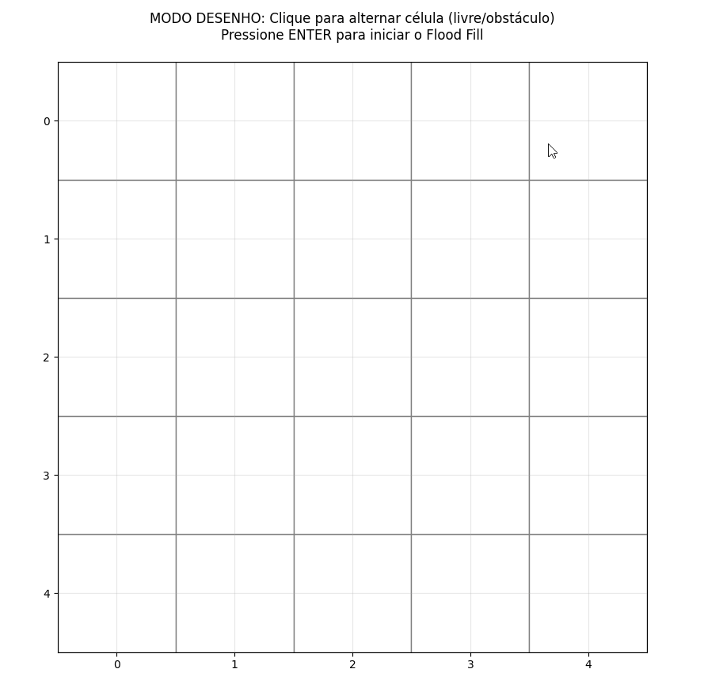
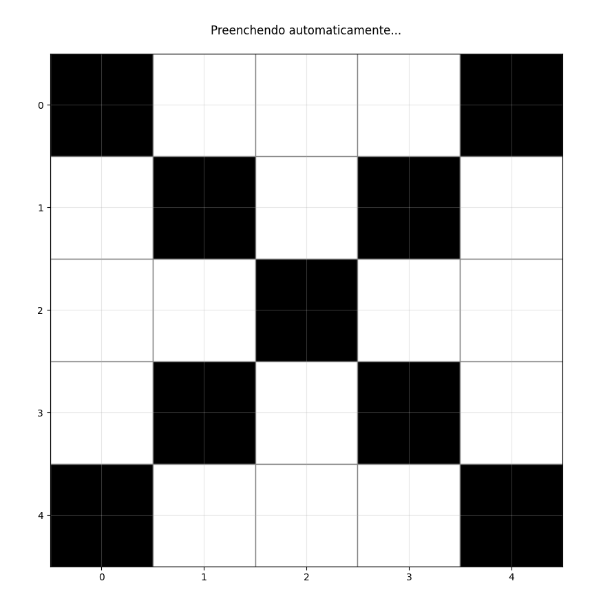
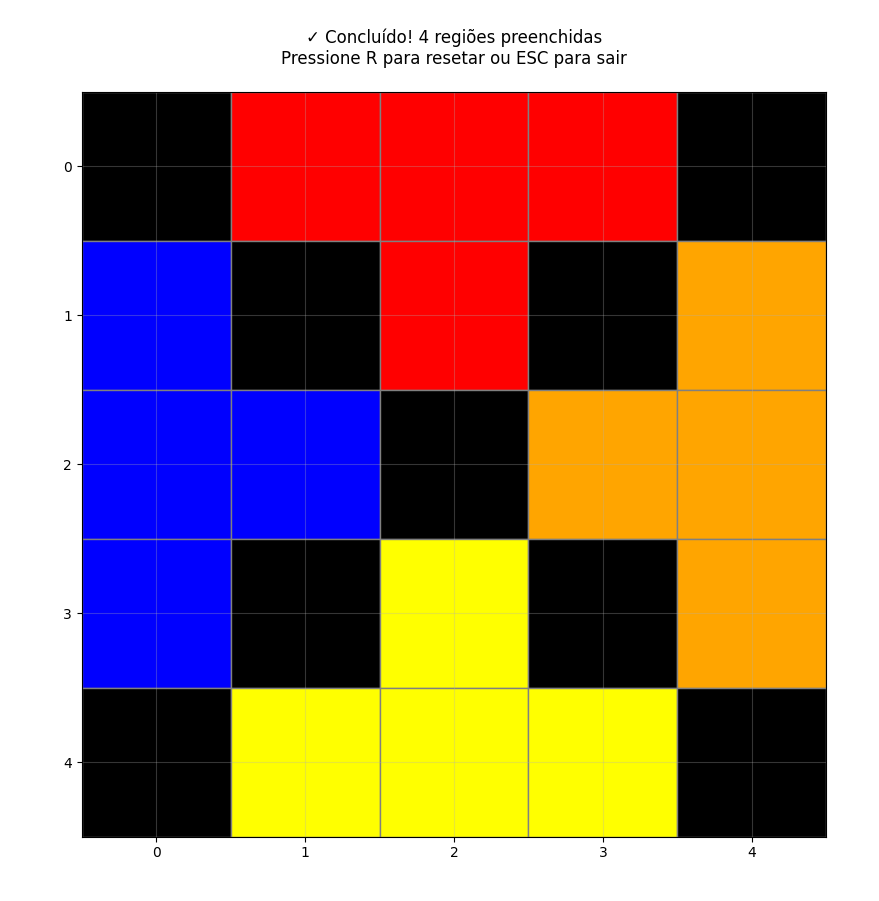
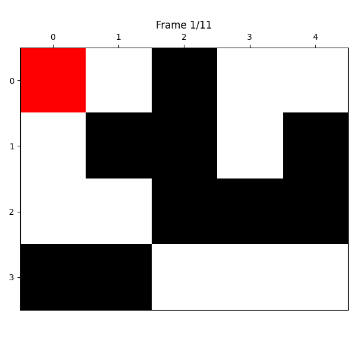
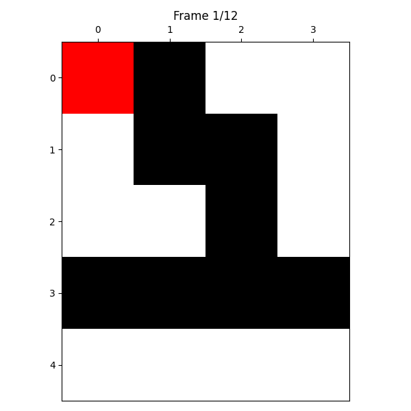
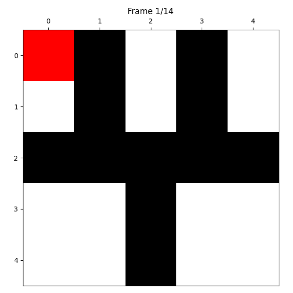

Trabalho 2 - Flood Fill V1.0

## Objetivo

Implementar o Algoritmo Flood Fill para identificar e preencher automaticamente todas as regiões conectadas em um grid 2D, usando cores/valores inteiros diferentes para cada região. Esta versão (V1.0) adiciona interface gráfica interativa completa, visualização animada, suporte para mais de 5 regiões e testes automatizados.

## O que foi adicionado nesta entrega (V1.0)

### Entrega 4 - Interface Gráfica Interativa

- **Aplicação interativa completa** (`interactive_floodfill.py`) com modo de desenho personalizado
  - **Modo Desenho**: Crie grids personalizados clicando para alternar células entre livre (branco) e obstáculo (preto)
  - **Animação Automática**: Ao pressionar ENTER, todas as regiões são preenchidas automaticamente com animação célula por célula
- **Suporte para 27+ regiões distintas**: Sistema com 7 cores base + 20 cores extras (roxo, ciano, rosa, marrom, cinza, violeta, etc.)
- **Animação frame-by-frame**: Visualização do preenchimento célula por célula em tempo real
- **Controles de teclado**:
  - `ENTER`: Inicia a animação automática de preenchimento de todas as regiões
  - `R`: Reseta o grid ao estado desenhado e volta ao modo desenho
  - `ESC`: Fecha a aplicação
- **Interface visual moderna**:
  - Janela maximizada/fullscreen
  - Grid com bordas cinzas e células coloridas
  - Título dinâmico mostrando progresso ("Preenchendo região X... Y/Z células")
  - Contador de regiões encontradas

### Entrega 3 - Testes e Validação

- Suite completa de testes automatizados com 21 casos de teste (`test_floodfill2.py`)
- Demonstração de casos de borda integrada ao `main2.py`

### Entrega 2 - Visualização

- Implementação de histórico de preenchimento para gerar frames de animação (`floodfill2.py`)
- Script de visualização e exportação de GIF (`visualize2.py`)
- Paleta de cores personalizada: branco (espaços livres), preto (obstáculos), vermelho, azul, laranja, amarelo e verde (regiões 1-5)
- Exemplos demonstrando 1, 2, 3, 4 e 5 regiões separadas (`main2.py`)

## Como gerar a animação (exemplo)

1. Instale dependências (recomendado em virtualenv):

```powershell
pip install matplotlib numpy pillow
```

2. Rode o script principal no diretório `Trabalho 2`:

```powershell
cd "Trabalho 2"
python main2.py
```

O script vai gerar múltiplos GIFs em `Trabalho 2/imgs/`:

- `exemplo_1_regiao.gif` - Demonstração com 1 região (toda vermelha)
- `exemplo_2_regioes.gif` - Demonstração com 2 regiões (vermelha e azul)
- `exemplo_3_regioes.gif` - Demonstração com 3 regiões (vermelha, azul e laranja)
- `exemplo_4_regioes.gif` - Demonstração com 4 regiões
- `exemplo_5_regioes.gif` - Demonstração com 5 regiões (todas as cores)

Você também pode executar diretamente o `visualize2.py` para um exemplo básico:

```powershell
python visualize2.py
```

## Interface Gráfica Interativa (Entrega 4)

Execute a aplicação interativa para desenhar grids e visualizar o flood fill automático:

```powershell
cd "Trabalho 2"
python interactive_floodfill.py
```

### Funcionalidades da Interface Interativa

#### Modo Desenho Personalizado

1. Escolha a opção "1. Desenhar grid personalizado (recomendado)"
2. Defina o tamanho do grid (ex: 5 linhas x 8 colunas)
3. **Desenhar o padrão:**
   - Clique nas células para alternar entre livre (branco) e obstáculo (preto)
   - Células brancas: espaços livres que serão preenchidos
   - Células pretas: obstáculos que separam regiões
4. **Iniciar animação:**
   - Pressione `ENTER` para iniciar o preenchimento automático
   - O algoritmo encontra e preenche todas as regiões automaticamente
   - Cada região é preenchida célula por célula com animação
5. **Resetar e redesenhar:**
   - Pressione `R` para voltar ao modo desenho
   - Modifique o padrão e teste novamente
6. **Sair:**
   - Pressione `ESC` para fechar a aplicação

#### Screenshots da Interface

**Modo Desenho - Criando o Grid:**



**Animação em Progresso:**



**Resultado Final:**



### Recursos Visuais

- **Paleta de cores rica**:
  - 7 cores base (branco, preto, vermelho, azul, laranja, amarelo, verde)
  - 20 cores extras (roxo, ciano, rosa, marrom, cinza, violeta, laranja escuro, etc.)
  - Suporte para 27+ regiões com cores completamente distintas
- **Animação suave**: Pausa de 0.05s entre células para visualização clara
- **Feedback em tempo real**:
  - Título mostra progresso ("Preenchendo região X... Y/Z células")
  - Console mostra log detalhado de cada região preenchida
- **Janela maximizada**: Abre automaticamente em tela cheia para melhor visualização

### Arquitetura do Interactive Flood Fill

**Classe `InteractiveFloodFill`:**

- `__init__`: Inicializa aplicação, configura janela maximizada, conecta eventos
- `setup_colors`: Define paleta de 27 cores distintas
- `setup_plot`: Desenha/atualiza visualização do grid
- `on_click`: Gerencia cliques do mouse (alternar células no modo desenho)
- `on_key`: Gerencia teclas (ENTER, R, ESC)
- `preencher_tudo_animado`: Loop principal que encontra e preenche todas as regiões com animação

**Fluxo de Execução:**

1. Usuário desenha padrão clicando nas células
2. ENTER salva estado inicial e inicia animação
3. Loop procura células vazias (valor 0)
4. Para cada região encontrada:
   - Chama `colorir_regiao_history` para gerar histórico frame-by-frame
   - Reproduz animação mostrando cada célula sendo preenchida
   - Incrementa contador de regiões
5. Ao finalizar, exibe total de regiões encontradas
6. R permite resetar e redesenhar

### Modo 2: Grid Pré-definido (Opcional)

1. Escolha a opção "2. Usar grid pré-definido"
2. Selecione o tamanho (pequeno 4x5 / médio 7x7 / grande 10x10)
3. Observe o grid de exemplo já desenhado
4. Pressione ENTER para visualizar a animação automática

## Testes Automatizados (Entrega 3)

A suite de testes cobre 21 cenários diferentes, incluindo casos de borda e situações complexas:

### Como executar os testes

```powershell
cd "Trabalho 2"
python -m unittest test_floodfill2.py -v
```

### Casos de teste implementados

- **Casos de borda:**

  - Grid vazio
  - Grid sem espaços livres (apenas obstáculos)
  - Início fora dos limites
  - Início em obstáculo
  - Grid de linha única
  - Grid de coluna única
  - Região isolada de um pixel

- **Funcionalidades básicas:**

  - Grid totalmente livre
  - Uma região
  - Duas regiões separadas
  - Grid complexo com três regiões
  - Cinco regiões distintas

- **Conectividade:**

  - Verificação de conectividade 4-direções
  - Preservação de regiões já coloridas

- **Recursos especiais:**
  - Histórico de preenchimento presente/ausente
  - Performance em grids grandes (20x20)

### Resultado dos testes

```
Ran 21 tests in 0.003s

OK
```

Todos os 21 testes passaram com sucesso, validando a robustez da implementação.

## Demonstração de Casos de Borda

O `main2.py` inclui uma seção interativa que demonstra visualmente como o algoritmo trata casos de borda:

```powershell
python main2.py
```

Os seguintes casos de borda são demonstrados:

1. **Grid vazio** - Retorna dicionário vazio sem erros
2. **Grid sem espaços livres** - Apenas obstáculos, nenhuma região preenchida
3. **Início fora dos limites** - Algoritmo continua e preenche a partir de (0,0)
4. **Início em obstáculo** - Ignora a célula inicial e processa as regiões restantes
5. **Região isolada de um pixel** - Preenche corretamente células únicas cercadas por obstáculos
6. **Grid de linha única** - Funciona corretamente em grids unidimensionais
7. **Conectividade 4-direções** - Demonstra que células diagonais não são conectadas

Cada caso mostra o grid inicial, o resultado do processamento e uma validação visual do comportamento esperado.

## Exemplos de Animações Geradas

### Exemplo 1 - Uma Região


### Exemplo 2 - Duas Regiões


### Exemplo 3 - Três Regiões



### Exemplo 4 - Quatro Regiões



### Exemplo 5 - Cinco Regiões



## Observações técnicas

- `colorir_regiao_history(grid, start, color, history)` preenche uma única região a partir do ponto inicial e grava cada passo no array `history` (usado na animação interativa)
- `colorir_todas_regioes(..., record_history=True)` encontra e preenche todas as regiões do grid, retornando um dicionário com as regiões e, sob a chave `-1`, uma lista de snapshots do grid (usado na geração de GIFs)
- A paleta de cores expandida suporta 27+ regiões:
  - **0**: Branco (espaços livres)
  - **1**: Preto (obstáculos)
  - **2-6**: Cores base (vermelho, azul, laranja, amarelo, verde)
  - **7-27**: 20 cores extras distintas (roxo, ciano, rosa, marrom, cinza, violeta, etc.)
- A interface interativa usa `colorir_regiao_history` para animação frame-by-frame
- Os GIFs usam `colorir_todas_regioes` com `record_history=True`

## Estrutura do Projeto

```
Trabalho 2/
├── floodfill2.py           # Algoritmo core de flood fill
├── visualize2.py           # Gerador de animações GIF
├── main2.py                # Exemplos e demonstrações
├── test_floodfill2.py      # Suite de testes automatizados
├── interactive_floodfill.py # Interface gráfica interativa
└── imgs/                   # Animações GIF geradas
```

## Resumo das Entregas

- ✅ **Entrega 1**: Algoritmo básico de flood fill
- ✅ **Entrega 2**: Visualização animada e exportação de GIFs
- ✅ **Entrega 3**: Testes automatizados e casos de borda
- ✅ **Entrega 4**: Interface gráfica interativa completa

## Próximas entregas

Projeto completo! Todas as funcionalidades foram implementadas.

---

Autores:

Filipe Faria Melo
Augusto Fuscaldi Cerezo
