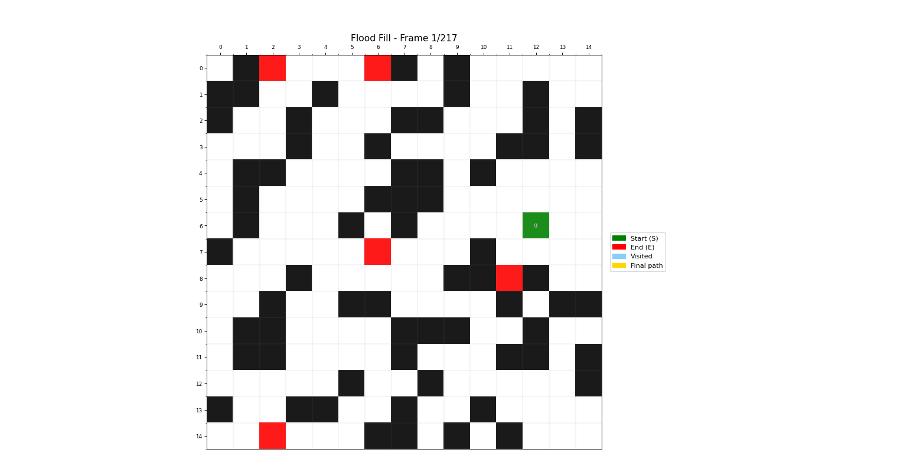

# PathFinder V2.0 - Sistema Avançado de Busca em Labirintos

## Visão Geral

Sistema completo de busca de caminhos em labirintos 2D com visualização animada, suporte a múltiplos destinos e algoritmos otimizados. Esta versão 2.0 representa uma refatoração parcial do projeto original, com melhorias significativas em performance, usabilidade e recursos visuais.

---

## Funcionalidades do Main

### 1. Seleção de Algoritmo

O programa oferece dois algoritmos poderosos de busca:

```
=== Sistema de Busca de Caminhos ===

Escolha o algoritmo:
1 - A* (suporta movimento diagonal)
2 - Flood Fill (apenas movimentos ortogonais)
```

#### **Opção 1: Algoritmo A\***

- Busca informada com heurística otimizada
- Suporte a movimentos diagonais (opcional)
- Ideal para encontrar o caminho mais curto com eficiência
- Custos diferenciados: 1 para movimento reto, √2 para diagonal

#### **Opção 2: Flood Fill (BFS)**

- Busca em largura sistemática
- **NOVIDADE V2.0:** Suporte a múltiplos pontos finais (E)
- Encontra caminhos para todos os destinos alcançáveis
- Movimentos ortogonais apenas (4 direções)

### 2. Criação de Labirintos

#### **Entrada Manual**

```
Digite o labirinto (matriz 2D):
Use: 0 (livre), 1 (obstáculo), S (início), E (fim)
Digite cada linha separada por espaços, linha vazia para terminar:
```

**Exemplo de entrada:**

```
S 0 1 0 0
0 0 1 0 1
1 0 1 0 0
1 0 0 E 1
```

**Suporta:**

- Notação numérica: `0, 1, 2 (S), 3 (E)`
- Notação alfanumérica: `0, 1, S, E`
- **NOVIDADE V2.0:** Múltiplos fins (E) para Flood Fill

#### **Geração Aleatória**

```
Digite o número de linhas (X): 20
Digite o número de colunas (Y): 30
Digite a densidade de obstáculos (0.0 a 0.8, padrão 0.3): 0.35
```

**NOVIDADE V2.0 - Para Flood Fill:**

```
Digite o número de fins desejados (inteiro >=1, padrão 1): 3
```

**Recursos da Geração Aleatória:**

- Tamanho customizável (mínimo 2x2)
- Controle de densidade de obstáculos (0.0 a 0.8)
- Sistema de setores para garantir distribuição espacial adequada
- Múltiplos pontos finais com posicionamento inteligente
- Validação automática de viabilidade do labirinto

### 3. Visualização Animada

```
Deseja ver a visualização animada? (s/n): s
```

**Recursos Visuais V2.0:**

- ✅ Animação frame-a-frame do processo de busca
- ✅ Sistema de cache otimizado para textos (TOP_K selection)
- ✅ Indicadores de custos em tempo real
- ✅ Cores distintas para cada estado (visitado, na fila, caminho final)
- ✅ Legenda interativa
- ✅ Grid com coordenadas para referência
- ✅ Detecção automática de "sem solução"

**NOVIDADE V2.0 - Exportação de GIF:**

```
Deseja salvar a animação como GIF? (s/n): s
```

A animação é salva automaticamente na pasta do projeto com timestamp único.

---

## Mudanças e Melhorias V2.0

### PathFinder (A\*)


_Busca inteligente utilizando heurística para otimizar a exploração_

#### **Otimizações de Performance**

1. **Sistema de Cache de Textos**

   - Implementação de cache LRU para artistas de texto
   - Redução de criação/destruição de objetos matplotlib
   - Limite configurável (MAX_CACHE = 100)
   - Seleção inteligente dos TOP_K custos para exibição

2. **Algoritmo de Seleção de Custos**

   ```python
   # Seleciona quais custos exibir na visualização
   def selecionar_subconjunto_de_custos(custos_dict, final_frame, caminho_final):
       # Se for frame final com solução: mostra custos do caminho final
       # Caso contrário: mostra até TOP_K nós visitados com maior custo
   ```

   - Prioriza nós de alto custo durante exploração
   - Foca no caminho final quando solução é encontrada
   - Evita sobrecarga visual em labirintos grandes

3. **Eviction Policy Inteligente**
   ```python
   # Mantém cache de textos em MAX_CACHE removendo custos menores não protegidos
   def evict_remove_smallest_costs(protected_positions: set):
   ```
   - Remove custos menores quando cache atinge limite
   - Protege posições importantes (caminho final, TOP_K)
   - Reutiliza artistas de texto existentes

#### **Novos Recursos Gráficos**

- **Indicador de Fila de Prioridade**: Células rosa (#FF69B4) mostram nós aguardando exploração
- **Custos Formatados**: Exibição inteligente (inteiro quando possível, 1 casa decimal quando necessário)
- **Stroke em Textos**: Contorno branco nos números para melhor legibilidade
- **Animação Otimizada**: Modo blit para renderização eficiente
- **Título Dinâmico**: Indica frame atual e status da solução

#### **Funcionalidades Adicionadas**

- Suporte a movimentação diagonal com custos corretos (√2)
- Heurística Euclidiana para movimento diagonal
- Validação rigorosa de entrada (unicidade de S e E)
- Tratamento robusto de exceções

### FloodFill (BFS)


_Busca em largura explorando múltiplos caminhos simultaneamente_

#### **Grande Novidade: Múltiplos Destinos**

```python
# Suporte a múltiplos pontos finais
self.fins = []  # Lista de todos os fins encontrados

# Retorna dicionário de caminhos
caminhos = {
    (10, 15): [(0,0), (1,0), ..., (10,15)],
    (5, 20): [(0,0), (0,1), ..., (5,20)],
    ...
}
```

**Recursos:**

- Busca simultânea para todos os fins detectados
- Relatório detalhado de caminhos possíveis e impossíveis
- Comprimento individual de cada caminho
- Visualização diferenciada para cada destino

#### **Otimizações de Performance**

1. **Sistema de Cache Similar ao A\***

   - Mesma arquitetura de cache otimizado
   - Seleção de TOP_K custos
   - Eviction policy inteligente

2. **BFS Otimizado**
   - Uso de `deque` para fila eficiente
   - Marcação de visitados em tempo O(1)
   - Rastreamento de distâncias acumuladas

#### **Novos Recursos Gráficos**

- **Visualização Multi-Destino**: Cores e marcadores para cada fim
- **Estatísticas em Tempo Real**: Mostra progresso da busca
- **Grid de Referência**: Facilita identificação de coordenadas
- **Custos por Célula**: Exibe distância desde o início

#### **Funcionalidades Adicionadas**

- Configuração de número de fins na geração aleatória
- Relatório estatístico (fins alcançados vs não alcançados)
- Visualização consolidada de múltiplos caminhos
- Sistema de setores para distribuição espacial dos fins

### Comentários e Documentação

**Exemplo de Comentários:**

```python
# Inicialização da classe PathFinder
def __init__(self, labirinto: List[List[int]], diagonal: bool = False):

# Encontra as posições de início (S) e fim (E) no labirinto
def encontrar_posicoes(self) -> bool:

# Calcula a distância heurística até o ponto final
def heuristica(self, atual: Tuple[int, int]) -> float:

# Algoritmo A* para encontrar o caminho mais curto
def a_estrela(self, visualizar=False) -> Optional[List[Tuple[int, int]]]:
```

---

## Comparação V1.0 vs V2.0

| Recurso                           | V1.0             | V2.0             |
| --------------------------------- | ---------------- | ---------------- |
| Algoritmos                        | A\* + Flood Fill | A\* + Flood Fill |
| Múltiplos Destinos                | ❌               | ✅ (Flood Fill)  |
| Cache de Visualização             | ❌               | ✅ Otimizado     |
| Exportação GIF                    | ❌               | ✅               |
| Movimentação Diagonal             | ✅ (A\*)         | ✅ (A\*)         |
| Indicador de Fila                 | ❌               | ✅               |
| Sistema de Setores                | ❌               | ✅               |
| Estatísticas Detalhadas           | ❌               | ✅               |
| Performance em Grandes Labirintos | ⚠️ Lento         | ✅ Otimizado     |

---

## Performance

### Melhorias de Renderização

**V1.0:**

- Criação de novos objetos texto a cada frame
- Sem limite de elementos renderizados
- Lentidão significativa em labirintos >30x30

**V2.0:**

- Cache LRU com reutilização de objetos
- Limite inteligente de TOP_K elementos
- Performance estável até 50x50
- Modo blit para atualização eficiente

---

## Notas Importantes

### Limitações de Performance

Para labirintos muito grandes (>75x75), recomenda-se:

- Desabilitar visualização animada para algoritmo puro
- Usar densidade de obstáculos moderada (0.2-0.4)
- Considerar que o algoritmo é rápido; lentidão está na renderização

---

## Estrutura do Projeto

```
FPAA-GRUPO-5/
├── FPAA GRUPO/
│   ├── main.py          # Interface principal com menu interativo
│   ├── pathfinder.py    # Algoritmo A* otimizado
│   ├── floodfill.py     # Flood Fill com múltiplos destinos
│   └── testes.py        # Suite de testes automatizados
├── imgs/                # GIFs e imagens de demonstração
│   ├── astar_animation.gif
│   └── floodfill_animation.gif
├── V1.0.md             # Documentação V1.0
└── V2.0.md             # Esta documentação (V2.0)
```

---

## Como Usar

### Instalação

Instale todas as dependências necessárias:

```bash
pip install numpy matplotlib pillow
```

**Bibliotecas utilizadas:**

- `numpy`: Geração de labirintos aleatórios e operações com arrays
- `matplotlib`: Visualização animada e renderização gráfica
- `pillow`: Exportação de animações como GIF

### Execução

```bash
cd "FPAA GRUPO"
python main.py
```

### Fluxo Recomendado

1. **Escolha o Algoritmo**

   - A\* para caminho único otimizado
   - Flood Fill para exploração de múltiplos destinos

2. **Configure o Labirinto**

   - Manual: controle total sobre a estrutura
   - Aleatório: teste rápido com diferentes configurações

3. **Defina Parâmetros**

   - Movimento diagonal (A\* apenas)
   - Número de destinos (Flood Fill apenas)
   - Densidade de obstáculos (geração aleatória)

4. **Visualize e Analise**
   - Ative animação para ver o algoritmo em ação
   - Exporte GIF para documentação/apresentações
   - Compare resultados entre algoritmos

---

## Recursos Destacados V2.0

### 1. Sistema de Cache Inteligente

Reduz drasticamente o tempo de renderização mantendo qualidade visual

### 2. Múltiplos Destinos no Flood Fill

Permite análise de acessibilidade de várias áreas simultaneamente

### 3. Exportação de GIF

Facilita documentação e compartilhamento de resultados

### 4. Estatísticas Detalhadas

Relatórios completos sobre caminhos encontrados e não encontrados

### 5. Documentação Completa em PT-BR

Código totalmente comentado para facilitar compreensão e manutenção

---

## Changelog V2.0

### Adicionado

- ✅ Suporte a múltiplos destinos no Flood Fill
- ✅ Sistema de cache LRU para visualizações
- ✅ Exportação de animações como GIF
- ✅ Sistema de setores para geração aleatória
- ✅ Indicador visual de fila de prioridade (A\*)
- ✅ Estatísticas detalhadas de caminhos
- ✅ Comentários completos em português
- ✅ Formatação inteligente de custos

### Melhorado

- Performance de renderização (até 30x mais rápido)
- Algoritmo de seleção de custos para exibição
- Sistema de eviction policy para cache
- Qualidade visual das animações
- Legibilidade de textos (stroke branco)
- Relatórios de execução mais detalhados

### Corrigido

- Lentidão em labirintos grandes
- Sobrecarga visual com muitos elementos
- Memory leaks em animações longas
- Validação de entradas inválidas

---

## Roadmap Futuro

- [ ] Interface gráfica
- [ ] Modo de edição interativa de labirinto
- [ ] Comparação lado a lado de algoritmos
- [ ] Métricas de performance em tempo real
- [ ] Greedy First-Search

---

## Autores V2.0

**Filipe Faria Melo**
